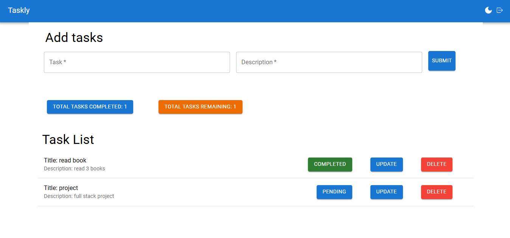

# Taskly - Task Management System



Taskly is a full-stack web application built with the MERN stack (MongoDB, Express, React, Node.js) that allows users to manage tasks effectively. It provides a platform for creating, updating, viewing, and deleting tasks. 

## Features
- **User Authentication:** Sign up and login functionality to ensure secure access to the platform.
- **Task Management:** Users can create, update, view, and delete tasks.
- **Responsive UI:** A user-friendly interface built using React and Material-UI.
- **Task Status:** Track tasks with their descriptions and status.

## Technologies Used
- **Frontend:** React.js, Material-UI, React Router
- **Backend:** Node.js, Express.js, MongoDB
- **Authentication:** JWT (JSON Web Token) for secure login and authentication

## Setup

### Prerequisites
Ensure you have the following installed:
- Node.js
- MongoDB (Local or MongoDB Atlas)

### Getting Started

1. Clone this repository:
   ```bash
   git clone https://github.com/your-username/taskly.git

2. Navigate to the backend directory and install dependencies:
   ```bash
   cd backend
   npm install

3. Navigate to the frontend directory and install dependencies:
   ```bash
   cd frontend
   npm install

4. Set up your MongoDB database and update the .env file in the backend directory with the MongoDB connection string.

5. Run the backend server:
   ```bash
   cd backend
   node app.js

6. Run the frontend server:
   ```bash
   cd frontend
   npm run start

